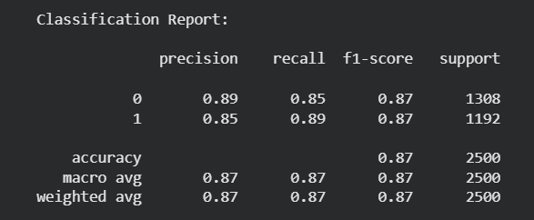
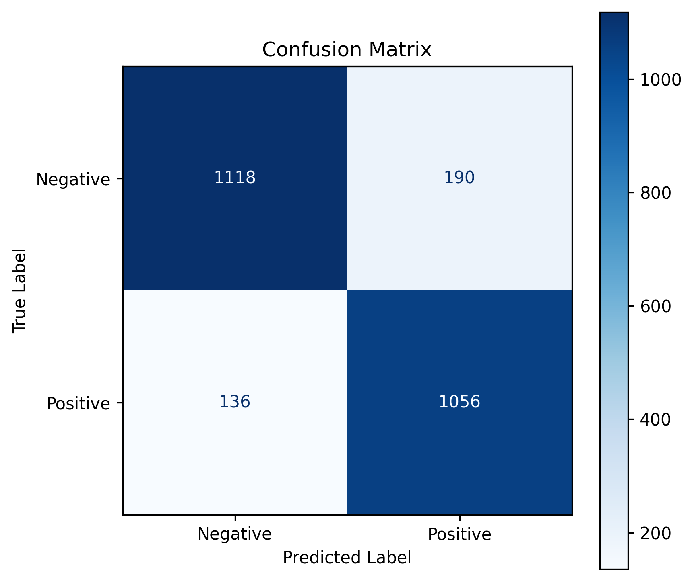
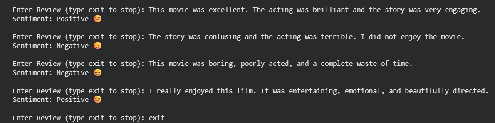

# NLP for Sentiment Analysis

## Sentiment Analysis of Customer Reviews Using Natural Language Processing and Machine Learning


Sentiment Analysis is a Natural Language Processing (NLP) technique used to identify and classify opinions expressed in textual data. This project analyzes customer reviews and predicts whether the sentiment is **Positive** or **Negative** using Machine Learning techniques.

The system preprocesses textual data, converts it into numerical features using **TF-IDF (Term Frequency-Inverse Document Frequency)**, and trains a **Logistic Regression** classifier to perform sentiment prediction. This project demonstrates how NLP and Machine Learning can be applied to automate customer feedback analysis and support data-driven decision-making.


## Features

- Customer review sentiment classification
- Text preprocessing and cleaning
- Tokenization and stop-word removal
- TF-IDF feature extraction
- Logistic Regression classification model
- Interactive sentiment prediction
- Model performance evaluation
- Easy-to-understand implementation using Python


## Objectives

- Collect customer review data.
- Preprocess and clean textual data.
- Convert text into numerical features.
- Train a machine learning model.
- Predict customer sentiment.
- Evaluate model performance.
- Visualize classification results.


## Technologies Used

- Python
- TensorFlow
- Pandas
- NumPy
- NLTK
- Scikit-learn
- Matplotlib
- Google Colab / Jupyter Notebook


## Machine Learning Algorithm

- Logistic Regression


## Dataset

**Dataset Name:** IMDb Movie Review Dataset

The dataset is provided by TensorFlow Keras and contains movie reviews labeled as Positive or Negative.

For this project, a reduced dataset containing **10,000 reviews** is included in the repository.

**Location:**

```
Dataset/
└── IMDb_Movie_Review_Dataset.csv
```

## Project Workflow

```
IMDb Movie Reviews
        │
        ▼
Data Collection
        │
        ▼
Text Preprocessing
        │
        ▼
TF-IDF Vectorization
        │
        ▼
Model Training
        │
        ▼
Sentiment Prediction
        │
        ▼
Performance Evaluation
```

## Sample Prediction

### Input

```
The movie was absolutely amazing and I enjoyed every scene.
```

### Output

```
Positive
```

### Input

```
The movie was boring and a complete waste of time.
```

### Output

```
Negative
```

## Results

The following outputs were generated after training and evaluating the Logistic Regression model on the IMDb Movie Review Dataset.

### Model Accuracy


### Classification Report




### Confusion Matrix




### Sample Prediction Output




The model successfully classifies IMDb movie reviews into **Positive** and **Negative** sentiments using **TF-IDF Vectorization** and **Logistic Regression**. The results include the model accuracy, detailed classification metrics, confusion matrix, and sample prediction output.

## Performance Evaluation

The trained model is evaluated using:

- Accuracy
- Precision
- Recall
- F1-Score

The project achieves good sentiment classification performance using TF-IDF feature extraction and Logistic Regression.


## Advantages

- Automates sentiment classification.
- Reduces manual analysis effort.
- Fast and efficient prediction.
- Easy to implement and understand.
- Suitable for customer feedback analysis.
- Can be extended for real-world business applications.

## Limitations

- Limited to binary sentiment classification.
- May not correctly interpret sarcasm or irony.
- Performance depends on dataset quality.
- Domain-specific language may reduce prediction accuracy.

## Applications

- Product review analysis
- Customer feedback systems
- Social media monitoring
- Brand reputation management
- Market research
- Opinion mining

## Future Enhancements

- Multiclass sentiment classification (Positive, Negative, Neutral)
- Deep Learning models (LSTM, GRU)
- Transformer-based models (BERT)
- Multilingual sentiment analysis
- Real-time social media sentiment monitoring
- Web application deployment using Flask or Streamlit


## License

This project is licensed under the **MIT License**.


